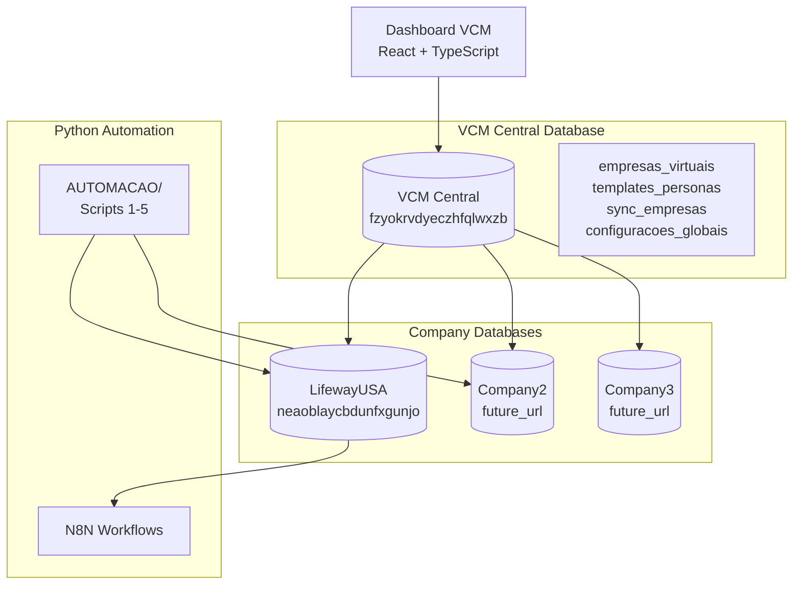

# Arquitetura Técnica do Dashboard VCM

## 🏗️ Arquitetura Geral

### Dual Database Architecture



## 🔄 Fluxo de Dados

### 1. Criação de Empresa Virtual

```
1. Usuário cria empresa no Dashboard
2. Dashboard insere em VCM Central (empresas_virtuais)
3. Sistema conecta/valida database da empresa
4. Cria templates de personas na empresa
5. Agenda primeira sincronização
```

### 2. Sincronização Bidirecional

```
VCM Central ←→ Company Database
     ↓              ↓
Configurações   Personas Reais
Templates       Competências
Status          RAG Knowledge
Logs            Workflows
```

### 3. Integração com Python Scripts

```
Dashboard → VCM Central → Company DB → Python Scripts → N8N
    ↑                                        ↓
    ← ← ← ← ← Status Updates ← ← ← ← ← ← ← ← ←
```

## 🛠️ Stack Tecnológico Detalhado

### Frontend Architecture

```
src/
├── components/
│   ├── ui/                    # shadcn/ui base components
│   │   ├── button.tsx
│   │   ├── card.tsx
│   │   ├── table.tsx
│   │   └── ...
│   ├── layout/               # Layout components
│   │   ├── Header.tsx
│   │   ├── Sidebar.tsx
│   │   ├── Layout.tsx
│   │   └── Navigation.tsx
│   ├── empresas/             # Company management
│   │   ├── EmpresaCard.tsx
│   │   ├── EmpresaForm.tsx
│   │   ├── EmpresaList.tsx
│   │   └── EmpresaSync.tsx
│   ├── personas/             # Persona management
│   │   ├── PersonaCard.tsx
│   │   ├── PersonaGrid.tsx
│   │   ├── PersonaForm.tsx
│   │   └── PersonaDetails.tsx
│   ├── competencias/         # Skills management
│   │   ├── CompetenciaList.tsx
│   │   ├── CompetenciaForm.tsx
│   │   └── SkillBadge.tsx
│   ├── workflows/            # N8N workflows
│   │   ├── WorkflowList.tsx
│   │   ├── WorkflowCard.tsx
│   │   └── WorkflowStatus.tsx
│   ├── sync/                 # Synchronization
│   │   ├── SyncStatus.tsx
│   │   ├── SyncLogs.tsx
│   │   ├── SyncButton.tsx
│   │   └── SyncIndicator.tsx
│   └── common/               # Shared components
│       ├── LoadingSpinner.tsx
│       ├── ErrorBoundary.tsx
│       ├── MetricCard.tsx
│       └── StatusBadge.tsx
├── pages/
│   ├── Dashboard.tsx         # Main overview
│   ├── Empresas.tsx          # Company management
│   ├── Personas.tsx          # Team management
│   ├── Competencias.tsx      # Skills management
│   ├── Workflows.tsx         # N8N workflows
│   ├── Sincronizacao.tsx     # Sync management
│   └── Configuracoes.tsx     # Settings
├── hooks/
│   ├── useEmpresas.ts        # Company data hooks
│   ├── usePersonas.ts        # Persona data hooks
│   ├── useSync.ts            # Sync operations
│   └── useSupabase.ts        # Supabase utilities
├── lib/
│   ├── supabase.ts           # Supabase client
│   ├── api/
│   │   ├── empresas.ts       # Company API calls
│   │   ├── personas.ts       # Persona API calls
│   │   ├── sync.ts           # Sync API calls
│   │   └── multi-db.ts       # Multi-database client
│   ├── utils/
│   │   ├── validation.ts     # Zod schemas
│   │   ├── formatting.ts     # Data formatters
│   │   └── constants.ts      # App constants
│   └── stores/
│       ├── authStore.ts      # Auth state
│       ├── empresaStore.ts   # Selected company
│       └── syncStore.ts      # Sync status
├── types/
│   ├── empresa.ts            # Company types
│   ├── persona.ts            # Persona types
│   ├── competencia.ts        # Skill types
│   ├── workflow.ts           # Workflow types
│   └── sync.ts               # Sync types
└── styles/
    ├── globals.css           # Global styles
    └── components.css        # Component styles
```

### Backend Integration

#### Supabase Client Configuration
```typescript
// lib/supabase.ts
export const supabaseVCM = createClient(
  process.env.VITE_VCM_SUPABASE_URL!,
  process.env.VITE_VCM_SUPABASE_ANON_KEY!
)

// lib/api/multi-db.ts
export const createCompanyClient = (empresa: Empresa) => {
  return createClient(
    empresa.supabase_url,
    empresa.supabase_anon_key
  )
}
```

#### API Layer Structure
```typescript
// lib/api/empresas.ts
export const empresasAPI = {
  getAll: () => Promise<Empresa[]>
  getById: (id: string) => Promise<Empresa>
  create: (data: CreateEmpresa) => Promise<Empresa>
  update: (id: string, data: UpdateEmpresa) => Promise<Empresa>
  delete: (id: string) => Promise<void>
  testConnection: (empresa: Empresa) => Promise<boolean>
}

// lib/api/sync.ts
export const syncAPI = {
  syncEmpresa: (empresaId: string) => Promise<SyncResult>
  getSyncLogs: (empresaId: string) => Promise<SyncLog[]>
  getSyncStatus: (empresaId: string) => Promise<SyncStatus>
  scheduledSync: (empresaId: string, schedule: string) => Promise<void>
}
```

## 🔄 Sistema de Sincronização

### Sync Engine Architecture

```typescript
interface SyncEngine {
  // Sync directions
  syncVCMToCompany(empresaId: string): Promise<SyncResult>
  syncCompanyToVCM(empresaId: string): Promise<SyncResult>
  bidirectionalSync(empresaId: string): Promise<SyncResult>
  
  // Conflict resolution
  resolveConflicts(conflicts: SyncConflict[]): Promise<void>
  
  // Monitoring
  getSyncStatus(empresaId: string): Promise<SyncStatus>
  getSyncLogs(empresaId: string): Promise<SyncLog[]>
}
```

### Sync Status States
```typescript
type SyncStatus = 
  | 'synchronized'  // ✅ Em sync
  | 'pending'       // 🔄 Pendente
  | 'syncing'       // ⏳ Sincronizando
  | 'error'         // ❌ Erro
  | 'conflict'      // ⚠️ Conflito
  | 'blocked'       // 🔒 Bloqueado
```

### Real-time Updates
```typescript
// Supabase realtime subscriptions
supabaseVCM
  .channel('sync_status')
  .on('postgres_changes', {
    event: 'UPDATE',
    schema: 'public',
    table: 'sync_empresas'
  }, handleSyncUpdate)
  .subscribe()
```

## 🔐 Segurança e Acesso

### Authentication Flow
```
1. User Login → Supabase Auth
2. JWT Token → Stored securely
3. RLS Policies → Database access control
4. Company Access → Based on user permissions
```

### Row Level Security (RLS)
```sql
-- Empresas: user can only see companies they have access to
CREATE POLICY "Users can view their companies" ON empresas_virtuais
  FOR SELECT USING (
    EXISTS (
      SELECT 1 FROM empresa_users 
      WHERE empresa_id = empresas_virtuais.id 
      AND user_id = auth.uid()
    )
  );

-- Personas: access through company membership
CREATE POLICY "Users can view company personas" ON personas
  FOR SELECT USING (
    EXISTS (
      SELECT 1 FROM empresa_users eu
      JOIN empresas_virtuais ev ON eu.empresa_id = ev.id
      WHERE ev.codigo_empresa = personas.empresa_id
      AND eu.user_id = auth.uid()
    )
  );
```

### Environment Variables
```bash
# VCM Central
VITE_VCM_SUPABASE_URL=https://fzyokrvdyeczhfqlwxzb.supabase.co
VITE_VCM_SUPABASE_ANON_KEY=eyJ...

# For service operations (backend only)
VCM_SUPABASE_SERVICE_ROLE_KEY=eyJ...

# API Keys (backend only)
OPENAI_API_KEY=sk-...
ANTHROPIC_API_KEY=sk-...
```

## 📊 Estado Global da Aplicação

### Zustand Stores
```typescript
// stores/authStore.ts
interface AuthState {
  user: User | null
  isLoading: boolean
  login: (email: string, password: string) => Promise<void>
  logout: () => Promise<void>
}

// stores/empresaStore.ts
interface EmpresaState {
  selectedEmpresa: Empresa | null
  empresas: Empresa[]
  setSelectedEmpresa: (empresa: Empresa) => void
  fetchEmpresas: () => Promise<void>
}

// stores/syncStore.ts
interface SyncState {
  syncStatus: Record<string, SyncStatus>
  syncLogs: SyncLog[]
  isMonitoring: boolean
  startMonitoring: () => void
  stopMonitoring: () => void
}
```

### React Query Integration
```typescript
// hooks/useEmpresas.ts
export const useEmpresas = () => {
  return useQuery({
    queryKey: ['empresas'],
    queryFn: empresasAPI.getAll,
    staleTime: 5 * 60 * 1000, // 5 minutes
  })
}

// hooks/usePersonas.ts
export const usePersonas = (empresaId: string) => {
  return useQuery({
    queryKey: ['personas', empresaId],
    queryFn: () => personasAPI.getByEmpresa(empresaId),
    enabled: !!empresaId,
  })
}
```

## 🚀 Performance e Otimização

### Code Splitting
```typescript
// Lazy loading das páginas
const Dashboard = lazy(() => import('./pages/Dashboard'))
const Empresas = lazy(() => import('./pages/Empresas'))
const Personas = lazy(() => import('./pages/Personas'))

// Suspense boundaries
<Suspense fallback={<LoadingSpinner />}>
  <Routes>
    <Route path="/" element={<Dashboard />} />
    <Route path="/empresas" element={<Empresas />} />
    <Route path="/personas" element={<Personas />} />
  </Routes>
</Suspense>
```

### Data Caching Strategy
```typescript
// React Query com cache inteligente
const queryClient = new QueryClient({
  defaultOptions: {
    queries: {
      staleTime: 5 * 60 * 1000,      // 5 min fresh
      cacheTime: 10 * 60 * 1000,     // 10 min cache
      retry: 2,
      refetchOnWindowFocus: false,
    },
  },
})
```

### Bundle Optimization
```typescript
// vite.config.ts
export default defineConfig({
  build: {
    rollupOptions: {
      output: {
        manualChunks: {
          vendor: ['react', 'react-dom'],
          ui: ['@radix-ui/react-dialog', '@radix-ui/react-dropdown-menu'],
          supabase: ['@supabase/supabase-js'],
        },
      },
    },
  },
})
```