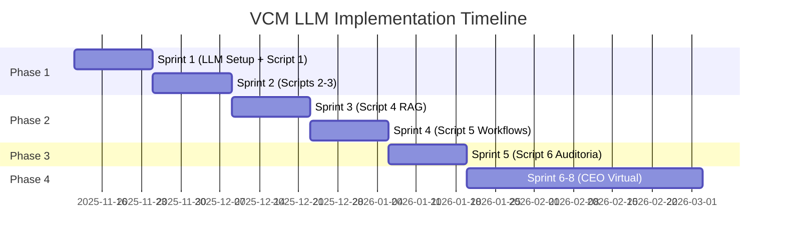

# 🎯 VCM - Plano de Implementação LLM

## 📋 Resumo Executivo

Migração do sistema VCM atual (baseado em matrizes estáticas) para arquitetura LLM que garante diversidade, realismo e alinhamento estratégico na geração de empresas virtuais.

---

## 🚀 Fases de Implementação

### Fase 1: Foundation LLM (Sprint 1-2)
**Objetivo**: Substituir geração estática por LLM nos scripts core

#### Sprint 1: Script 1 + Infraestrutura LLM
- ✅ Setup de APIs LLM (OpenAI + Anthropic)
- ✅ Sistema de prompts padronizados
- ✅ Gerador de biografias com LLM
- ✅ Validação de qualidade automática
- ✅ Testes A/B vs sistema atual

#### Sprint 2: Scripts 2-3 LLM
- 🔄 Extração de competências via LLM
- 🔄 Geração de tech specs inteligente
- 🔄 Cross-validation entre scripts
- 🔄 Otimização de prompts

### Fase 2: Advanced Processing (Sprint 3-4)
**Objetivo**: RAG e Workflows inteligentes

#### Sprint 3: Script 4 RAG
- 📅 Knowledge base generation
- 📅 Vetorização e indexação
- 📅 Context-aware documentation
- 📅 Integration com ferramentas

#### Sprint 4: Script 5 Workflows
- 📅 Workflow generation via LLM
- 📅 N8N integration automática
- 📅 Dependency mapping
- 📅 Performance optimization

### Fase 3: Intelligent Audit (Sprint 5)
**Objetivo**: Sistema de auditoria e alinhamento

#### Sprint 5: Script 6 Auditoria
- 📅 Objective decomposition engine
- 📅 Alignment analysis
- 📅 Gap identification
- 📅 Action plan generation

### Fase 4: CEO Virtual (Sprint 6-8)
**Objetivo**: Assistente conversacional para objetivos

#### Sprint 6-8: Advanced Features
- 📅 Conversational interface
- 📅 Market data integration
- 📅 Predictive analysis
- 📅 Auto-optimization

---

## 🔧 Implementação Técnica

### Arquitetura de Prompts

```python
class PromptManager:
    def __init__(self):
        self.templates = {
            'biografia_ceo': CEOBiographyPrompt(),
            'biografia_especialista': SpecialistPrompt(),
            'competencias_extração': CompetencyExtractionPrompt(),
            'tech_specs': TechSpecificationPrompt(),
            'rag_generation': RAGGenerationPrompt(),
            'workflow_creation': WorkflowPrompt(),
            'audit_alignment': AuditPrompt()
        }
    
    def generate(self, template_name, context):
        return self.templates[template_name].render(context)
```

### LLM Integration Layer

```python
class LLMService:
    def __init__(self):
        self.openai_client = OpenAIClient()
        self.anthropic_client = AnthropicClient()
        self.fallback_strategy = ['openai', 'anthropic']
    
    async def generate(self, prompt, provider='auto'):
        for provider_name in self.fallback_strategy:
            try:
                return await self._call_provider(provider_name, prompt)
            except Exception as e:
                logging.warning(f"Provider {provider_name} failed: {e}")
                continue
        raise Exception("All LLM providers failed")
    
    def validate_output(self, output, schema):
        return JSONValidator.validate(output, schema)
```

### Quality Assurance

```python
class QualityGate:
    def __init__(self):
        self.thresholds = {
            'biografia_score': 7.5,
            'competencia_coverage': 0.85,
            'workflow_completeness': 0.90,
            'alignment_score': 0.80
        }
    
    def evaluate(self, content, content_type):
        score = self._calculate_score(content, content_type)
        threshold = self.thresholds.get(content_type, 0.7)
        return score >= threshold, score
```

---

## 📊 Estrutura de Dados

### Enhanced Database Schema

```sql
-- Scripts execution tracking
CREATE TABLE script_executions (
    id UUID PRIMARY KEY,
    empresa_id UUID REFERENCES empresas(id),
    script_number INTEGER,
    status TEXT,
    llm_provider TEXT,
    quality_score DECIMAL,
    execution_time INTERVAL,
    prompt_used TEXT,
    created_at TIMESTAMP
);

-- LLM interactions log
CREATE TABLE llm_interactions (
    id UUID PRIMARY KEY,
    execution_id UUID REFERENCES script_executions(id),
    provider TEXT,
    prompt_hash TEXT,
    input_tokens INTEGER,
    output_tokens INTEGER,
    cost_usd DECIMAL,
    latency_ms INTEGER,
    created_at TIMESTAMP
);

-- Quality metrics
CREATE TABLE quality_metrics (
    id UUID PRIMARY KEY,
    execution_id UUID REFERENCES script_executions(id),
    metric_name TEXT,
    metric_value DECIMAL,
    threshold DECIMAL,
    passed BOOLEAN,
    created_at TIMESTAMP
);

-- Objectives and alignment
CREATE TABLE company_objectives (
    id UUID PRIMARY KEY,
    empresa_id UUID REFERENCES empresas(id),
    objective_text TEXT,
    decomposed_objectives JSONB,
    created_by TEXT,
    created_at TIMESTAMP
);

CREATE TABLE alignment_audits (
    id UUID PRIMARY KEY,
    empresa_id UUID REFERENCES empresas(id),
    objective_id UUID REFERENCES company_objectives(id),
    alignment_score DECIMAL,
    gaps_identified JSONB,
    recommendations JSONB,
    action_plan JSONB,
    created_at TIMESTAMP
);
```

---

## 🎯 Testing Strategy

### Unit Tests
```python
class TestLLMIntegration:
    def test_biografia_generation(self):
        # Test biography quality and structure
        pass
    
    def test_competencia_extraction(self):
        # Test skill extraction accuracy
        pass
    
    def test_prompt_consistency(self):
        # Test prompt template rendering
        pass
    
    def test_quality_gates(self):
        # Test quality thresholds
        pass
```

### Integration Tests
```python
class TestScriptChaining:
    def test_end_to_end_generation(self):
        # Test complete script chain 1-6
        pass
    
    def test_data_consistency(self):
        # Test data flow between scripts
        pass
    
    def test_llm_fallback(self):
        # Test provider failover
        pass
```

### Performance Tests
```python
class TestPerformance:
    def test_generation_speed(self):
        # Target: < 5 minutes per company
        pass
    
    def test_concurrent_execution(self):
        # Test multiple company generation
        pass
    
    def test_cost_efficiency(self):
        # Monitor LLM API costs
        pass
```

---

## 📈 Success Metrics

### Quality Metrics
- **Diversity Score**: Variação nos perfis gerados (target: >90%)
- **Realism Score**: Avaliação humana de realismo (target: >8.5/10)
- **Consistency Score**: Alinhamento entre scripts (target: >95%)
- **Completeness Score**: Cobertura de competências (target: >90%)

### Performance Metrics
- **Generation Time**: Tempo total de geração (target: <5min)
- **Success Rate**: Taxa de execução sem erros (target: >98%)
- **Cost per Company**: Custo LLM por empresa (target: <$2.00)
- **User Satisfaction**: Feedback qualitativo (target: >4.5/5)

### Business Metrics
- **Adoption Rate**: Empresas geradas por mês
- **Retention Rate**: Usuários que geram >1 empresa
- **Feature Usage**: Utilização do Script 6 auditoria
- **ROI**: Valor gerado vs custo de desenvolvimento

---

## 🔄 Continuous Improvement

### Feedback Loop
1. **Monitoring**: Tracking de quality scores e user feedback
2. **Analysis**: Identificação de padrões e problemas
3. **Optimization**: Ajuste de prompts e thresholds
4. **Validation**: A/B testing de melhorias

### Prompt Evolution
- **Version Control**: Tracking de mudanças nos prompts
- **Performance Analysis**: Impacto de mudanças na qualidade
- **Rollback Strategy**: Capacidade de reverter prompts
- **Community Input**: Feedback de usuários avançados

---

## 💰 Cost Analysis

### LLM Usage Estimation
```yaml
Per Company Generation:
  Script 1 (Biografias): ~20k tokens = $0.30 (Gemini 2.5 Flash)
  Script 2 (Competências): ~15k tokens = $0.25 (Gemini 2.5 Flash)
  Script 3 (Tech Specs): ~10k tokens = $0.15 (Gemini 2.5 Flash)
  Script 4 (RAG): ~25k tokens = $0.35 (Gemini 2.5 Flash)
  Script 5 (Workflows): ~20k tokens = $0.30 (Gemini 2.5 Flash)
  Script 6 (Auditoria): ~15k tokens = $0.25 (Gemini 2.5 Flash)
  
Total per Company: ~$1.60 (35% cheaper with Gemini 2.5 Flash)
Monthly at 100 companies: ~$160
```

### Infrastructure Costs
- **Database**: Supabase Pro ~$25/month
- **API Services**: FastAPI hosting ~$20/month
- **Frontend**: Vercel Pro ~$20/month
- **Monitoring**: Logging/metrics ~$10/month

**Total Monthly**: ~$285 (excluding LLM costs)

---

## 🚦 Risk Mitigation

### Technical Risks
- **LLM Downtime**: Multi-provider fallback strategy
- **Cost Overrun**: Usage monitoring and caps
- **Quality Degradation**: Automated quality gates
- **Data Loss**: Automated backups and versioning

### Business Risks
- **User Adoption**: Comprehensive onboarding
- **Competitive Pressure**: Continuous feature development
- **Regulatory Changes**: Compliance monitoring
- **Market Changes**: Flexible architecture

---

## 📅 Timeline



---

## 🎯 Next Steps

### Immediate Actions (Week 1)
1. ✅ Setup LLM API accounts (OpenAI + Anthropic)
2. ✅ Create prompt template system
3. ✅ Implement Script 1 LLM version
4. ✅ Setup quality validation pipeline

### Short Term (Weeks 2-4)
1. 🔄 Complete Scripts 2-3 LLM migration
2. 🔄 Implement cross-validation system
3. 🔄 Performance optimization
4. 🔄 User testing and feedback

### Medium Term (Months 2-3)
1. 📅 Complete all 6 scripts with LLM
2. 📅 Deploy to production
3. 📅 Monitor and optimize
4. 📅 Prepare for CEO Virtual phase

---

*Plano de implementação v2.0.0*
*Atualizado: November 2025*