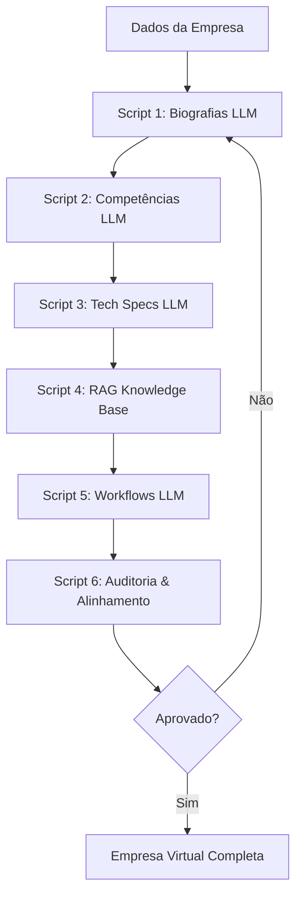

# 🎯 VCM - Sistema de Geração de Empresas Virtuais com IA

## 📋 Visão Geral

O Virtual Company Manager (VCM) é um sistema automatizado que gera empresas virtuais completas com funcionários realistas, competências específicas, conhecimento técnico e fluxos de trabalho estruturados, utilizando Large Language Models (LLM) para garantir diversidade e realismo.

---

## 🏗️ Arquitetura do Sistema

### Princípios Fundamentais

1. **Diversidade Real**: Uso de LLM para evitar "bolhas de resultados" limitados
2. **Encadeamento Inteligente**: Cada etapa alimenta a próxima com dados enriquecidos
3. **Alinhamento por Objetivos**: Todos os componentes alinhados aos objetivos empresariais
4. **Auto-validação**: Sistema de auditoria contínua para garantir coerência

### Fluxo de Processamento



---

## 🔧 Scripts do Sistema

### 📝 Script 1: Gerador de Biografias (LLM)

**Objetivo**: Criar personas realistas e diversificadas baseadas em dados do mundo real.

**Input**:
- Nome da empresa
- Indústria/setor
- Cultura organizacional
- Localização geográfica
- Tamanho da empresa

**Processo LLM**:
```
PROMPT: "Gere uma biografia realista para um [cargo] em uma empresa de [indústria] 
localizada em [país]. A empresa tem [tamanho] funcionários e cultura [cultura]. 
Inclua: nome completo, idade, formação, experiência, idiomas, especialização específica 
e história profissional convincente baseada em perfis reais do LinkedIn."
```

**Output**:
- Biografias detalhadas em Markdown
- Dados estruturados JSON
- Fotos de perfil (opcional, via IA)
- Histórico profissional realista

---

### 🎯 Script 2: Análise de Competências (LLM)

**Objetivo**: Extrair competências técnicas e comportamentais das biografias geradas.

**Input**:
- Biografias do Script 1
- Descrições de cargos da empresa
- Objetivos departamentais

**Processo LLM**:
```
PROMPT: "Analise esta biografia: [biografia]. Extraia competências técnicas e 
comportamentais específicas. Considere o contexto da empresa [empresa] no setor 
[setor]. Liste competências observáveis, mensuráveis e relevantes para o cargo 
[cargo]. Inclua nível de proficiência (1-5) e evidências da biografia."
```

**Output**:
- Matriz de competências por pessoa
- Níveis de proficiência
- Gaps de competências identificados
- Recomendações de desenvolvimento

---

### ⚙️ Script 3: Especificações Técnicas (LLM)

**Objetivo**: Definir ferramentas, tecnologias e recursos necessários para cada função.

**Input**:
- Competências do Script 2
- Objetivos de cada função
- Orçamento e recursos disponíveis

**Processo LLM**:
```
PROMPT: "Baseado nestas competências [competências] para o cargo [cargo], defina:
1. Ferramentas de software necessárias
2. Hardware requerido
3. Plataformas e sistemas
4. Integrações necessárias
5. Nível de acesso a cada recurso
Considere empresa [empresa] no setor [setor] com orçamento [faixa]."
```

**Output**:
- Lista de softwares por pessoa
- Especificações de hardware
- Licenças necessárias
- Configurações de acesso
- Estimativa de custos

---

### 📚 Script 4: Geração de Base RAG

**Objetivo**: Criar knowledge base personalizada para cada função desempenhar suas atividades.

**Input**:
- Tech Specs do Script 3
- Competências específicas
- Melhores práticas da indústria

**Processo LLM**:
```
PROMPT: "Crie uma base de conhecimento para [cargo] com estas competências 
[competências] usando estas ferramentas [ferramentas]. Inclua:
1. Procedimentos operacionais padrão
2. Troubleshooting guides
3. Best practices da indústria [indústria]
4. Conhecimento específico das ferramentas
5. Casos de uso comuns
6. Integrações com outros departamentos"
```

**Output**:
- Documentação técnica personalizada
- Guias de procedimentos
- Base de conhecimento vetorizada
- Índices de busca
- Relacionamentos entre conceitos

---

### 🔄 Script 5: Workflows e Processos (LLM)

**Objetivo**: Gerar fluxos de trabalho individuais e coletivos baseados em competências e RAG.

**Input**:
- RAG Knowledge Base do Script 4
- Competências mapeadas
- Objetivos empresariais
- Estrutura organizacional

**Processo LLM**:
```
PROMPT: "Baseado no conhecimento [RAG] e competências [competências], crie workflows 
para [cargo] que contribuam para os objetivos [objetivos]. Considere:
1. Processos individuais diários
2. Colaborações interdepartamentais
3. Escalações e aprovações
4. Métricas de sucesso
5. Pontos de integração com outros workflows
6. Contingências e exceções"
```

**Output**:
- Diagramas de workflow (BPMN)
- Configurações N8N
- Definição de roles e responsabilidades
- KPIs e métricas
- Integrações automatizadas

---

### 🔍 Script 6: Auditoria e Alinhamento (LLM)

**Objetivo**: Validar alinhamento entre competências, workflows e objetivos empresariais.

**Input do Usuário**:
```
"Quais são os objetivos principais da empresa para os próximos 12 meses?"
Exemplo: "Aumentar receita em 30%, expandir para 2 novos mercados, 
melhorar satisfação do cliente para 95%"
```

**Processo LLM - Fase 1**:
```
PROMPT: "Analise estes objetivos empresariais: [objetivos_usuario].
Subdivida-os por função organizacional:
- CEO: [objetivos específicos]
- Marketing: [objetivos específicos]  
- Vendas: [objetivos específicos]
- Etc...

Para cada função, defina:
1. Objetivos mensuráveis
2. KPIs específicos
3. Prazos realistas
4. Dependências entre funções"
```

**Processo LLM - Fase 2**:
```
PROMPT: "Verifique alinhamento entre:
OBJETIVOS: [objetivos_por_funcao]
COMPETÊNCIAS: [competencias_existentes]
WORKFLOWS: [workflows_atuais]

Identifique:
1. Gaps de competências para atingir objetivos
2. Workflows ausentes ou inadequados
3. Sobreposições ou conflitos
4. Oportunidades de otimização
5. Riscos de não alinhamento"
```

**Output**:
- Relatório de gaps por função
- Matriz de alinhamento objetivos x competências
- Workflows faltantes identificados
- Recomendações de ajustes
- Plano de ação prioritizado
- Score de alinhamento geral (0-100)

---

## 🔄 Integração LLM

### Configuração de APIs

```yaml
LLM_PROVIDERS:
  primary: openai-gpt4
  fallback: anthropic-claude
  specialized:
    biografias: openai-gpt4
    competencias: anthropic-claude
    workflows: openai-gpt4
    auditoria: anthropic-claude

PARAMETERS:
  temperature: 0.7
  max_tokens: 4000
  timeout: 60s
  retry_attempts: 3
```

### Prompt Engineering

- **Templates padronizados** para cada script
- **Context injection** com dados da empresa
- **Output formatting** estruturado (JSON + Markdown)
- **Quality validation** com prompts de revisão
- **Consistency checking** entre scripts

---

## 📊 Parâmetros de Avaliação

### 1. Competências
- **Técnicas**: Ferramentas, linguagens, certificações
- **Comportamentais**: Liderança, comunicação, adaptabilidade
- **Níveis**: Iniciante (1) → Expert (5)
- **Evidências**: Baseadas em biografia e experiência

### 2. Workflows
- **Eficiência**: Tempo de execução, automação
- **Qualidade**: Controles, validações, outputs
- **Colaboração**: Pontos de integração, comunicação
- **Flexibilidade**: Adaptação a mudanças, exceções

### 3. Objetivos
- **SMART**: Específicos, Mensuráveis, Atingíveis, Relevantes, Temporais
- **Alinhamento**: Vertical (empresa → função) e Horizontal (entre funções)
- **Rastreabilidade**: KPIs, métricas, responsáveis
- **Adaptabilidade**: Revisão e ajuste contínuo

---

## 🎯 Fase 2: CEO Virtual

### Assistente Virtual CEO
- **Definição de Objetivos**: Interface conversacional para CEO
- **Análise de Mercado**: Integração com dados externos
- **Revisão Contínua**: Ajustes baseados em performance
- **Simulações**: Cenários what-if para planejamento

### Funcionalidades Avançadas
- **Análise Preditiva**: Impacto de mudanças nos objetivos
- **Otimização Automática**: Sugestões de realocação de recursos
- **Benchmarking**: Comparação com empresas similares
- **Alertas Inteligentes**: Detecção de desalinhamentos

---

## 🔧 Implementação Técnica

### Stack Tecnológico
- **Backend**: Python FastAPI
- **Frontend**: Next.js + TypeScript
- **LLM Integration**: OpenAI API + Anthropic API
- **Database**: Supabase (PostgreSQL)
- **Workflows**: N8N
- **Vectorization**: Pinecone/Weaviate

### Estrutura de Dados
```sql
-- Empresas
CREATE TABLE empresas (
  id UUID PRIMARY KEY,
  nome TEXT NOT NULL,
  industria TEXT,
  objetivos JSONB,
  created_at TIMESTAMP
);

-- Personas
CREATE TABLE personas (
  id UUID PRIMARY KEY,
  empresa_id UUID REFERENCES empresas(id),
  nome_completo TEXT,
  biografia_md TEXT,
  competencias JSONB,
  tech_specs JSONB,
  workflows JSONB
);

-- Auditorias
CREATE TABLE auditorias (
  id UUID PRIMARY KEY,
  empresa_id UUID REFERENCES empresas(id),
  score_alinhamento INTEGER,
  gaps_identificados JSONB,
  recomendacoes JSONB,
  created_at TIMESTAMP
);
```

---

## 📈 Métricas de Sucesso

### Qualidade dos Outputs
- **Diversidade**: Variação nos perfis gerados
- **Realismo**: Coerência com mercado real
- **Consistência**: Alinhamento entre scripts
- **Completude**: Cobertura de todas as funções

### Performance do Sistema
- **Tempo de Geração**: Meta < 5 minutos por empresa
- **Taxa de Aprovação**: Meta > 90% na auditoria
- **Satisfação do Usuário**: Feedback qualitativo
- **Reutilização**: Aproveitamento entre projetos

---

## 🚀 Roadmap de Desenvolvimento

### Fase 1: Foundation (Atual)
- ✅ Scripts 1-5 com LLM integration
- ✅ Script 6 com input manual de objetivos
- ✅ Dashboard web funcional
- ✅ Integração Supabase

### Fase 2: CEO Virtual (Próxima)
- 🔄 Assistente conversacional CEO
- 🔄 Análise preditiva de objetivos
- 🔄 Integração com dados de mercado
- 🔄 Auto-otimização de workflows

### Fase 3: Enterprise (Futura)
- 📅 Multi-tenancy
- 📅 APIs públicas
- 📅 Integrações ERP/CRM
- 📅 Marketplace de templates

---

*Documentação atualizada: November 2025*
*Versão: 2.0.0 - LLM Integration*